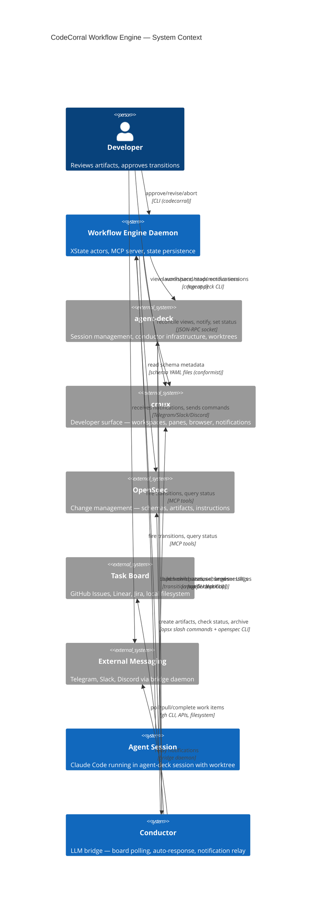
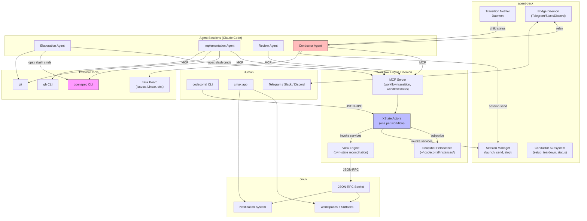
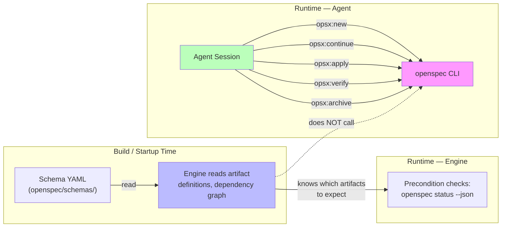

# CodeCorral Workflow Engine — System Context

How the components actually interact at runtime. This document corrects a common misconception from the contracts: the workflow engine does **not** talk to OpenSpec directly. Agents do. The engine orchestrates sessions and tracks state — it delegates domain work to agents who use the appropriate tools.

---

## System Context Diagram

---

## Component Interaction Diagram

---

## Who Talks to Whom

| Source | Target | Protocol | What |
|--------|--------|----------|------|
| Engine | agent-deck | CLI (`launch`, `send`, `stop`) | Create/manage agent sessions (as conductor children) |
| Engine | agent-deck | CLI (`conductor setup/teardown`) | Conductor lifecycle |
| Engine | cmux | JSON-RPC socket | Reconcile views, notifications, status pills |
| Engine | OpenSpec | Read schema YAML files | Know which artifacts exist (conformist) |
| Agent | Engine | MCP (`workflow.transition`) | Fire state transitions |
| Agent | Engine | MCP (`workflow.status`) | Query current state |
| Agent | OpenSpec | CLI (`openspec` via opsx) | Create artifacts, check status, archive |
| Agent | git | CLI | Commits, branches, worktree operations |
| Agent | gh | CLI | PR creation, issue management |
| Agent | cmux | CLI/socket (optional) | Open own panes, set browser URLs |
| Conductor | Engine | MCP (`workflow.transition`) | Start workflows, advance state based on judgment |
| Conductor | agent-deck | CLI (`session send`, `launch`) | Manage child sessions |
| Conductor | Board | `gh` CLI, APIs, filesystem | Poll, pull, complete work items (LLM-driven, no adapter) |
| Human | Engine | CLI (`codecorral approve/revise/abort`) | Review decisions |
| Human | Engine | CLI (`codecorral pull`) | Delegates to conductor to start a workflow |
| Human | cmux | App UI | View workspaces, read notifications |
| agent-deck notifier | Conductor | `session send` | Child session status changes |
| agent-deck bridge | External messaging | Bot APIs | Relay conductor ↔ Telegram/Slack/Discord |

**Key insights:**
- The engine never talks to OpenSpec's CLI at runtime (conformist). Agents use opsx slash commands for all artifact operations.
- The engine never talks to task boards. The conductor polls/pulls/completes work items using `gh`, APIs, and LLM judgment.
- `codecorral pull` delegates to the conductor — the conductor is the single entry point for all new workflows.
- Hook events (like `tests.passed`) fire freely; if the machine has no transition for that event in the current state, it's silently rejected. Hooks don't need to know workflow state.

---

## Simplest End-to-End Sequence: Manual Pull → Proposal → Review → Implementation → Complete

This is a single unit brief, manual pull, incremental route, one review round, no code review agent.

```mermaid
sequenceDiagram
    participant H as Human
    participant CLI as codecorral CLI
    participant E as Engine (XState)
    participant AD as agent-deck
    participant CX as cmux
    participant C as Conductor
    participant A as Agent
    participant OS as openspec

    Note over H,OS: Phase 0 — Pull (delegated to conductor)

    H->>CLI: codecorral pull ./path/to/brief.md
    CLI->>E: pull request for ./path/to/brief.md
    activate E
    E->>AD: agent-deck session send "conductor-main" "Developer wants to start workflow for brief at ./path/to/brief.md. Evaluate and call workflow.transition('workflow.pull', {unitBriefRef: ...})."
    deactivate E
    AD->>C: (message delivered)
    activate C
    C->>C: Read brief, evaluate suitability
    C->>E: workflow.transition("workflow.pull", { unitBriefRef: { source: "manual", path: "./path/to/brief.md", title: "hm-deploy" } })
    deactivate C
    activate E
    E->>E: Create actor, initial state: PULLED

    Note over E: Invoke: createElaborationSession (as conductor child)

    E->>AD: agent-deck launch . -t "cc-hm-deploy-elab" -c claude --parent "conductor-main" -w "wfe/hm-deploy/elab" -b --mcp workflow-engine -m "You are elaborating..."
    AD-->>E: { title, worktree, status: running }
    E->>E: assign sessionTitle, worktreePath to context

    Note over E: Invoke: reconcileView

    E->>CX: workspace.create
    CX-->>E: { workspace_id: "workspace:3" }
    E->>CX: workspace.rename "hm-deploy — Elaborating"
    E->>CX: surface.split { direction: "right" }
    E->>CX: set_status { key: "phase", value: "Elaborating" }
    E->>CX: notification.create { title: "Workflow started", body: "hm-deploy" }
    E->>E: assign workspaceId, surfaceIds to viewState
    deactivate E

    Note over H,OS: Phase 1 — Elaboration

    activate A
    A->>OS: openspec new change "hm-deploy" --schema spec-driven
    A->>E: workflow.transition("context.loaded")
    E-->>A: { accepted: true, newState: "elaborating.routing" }

    Note over E: Invoke: instructConductor (evaluate route)

    E->>AD: session send "conductor-main" "Evaluate brief at /path..."
    AD->>C: (message delivered)
    activate C
    C->>E: workflow.transition("route.decided", { route: "incremental", reasoning: "..." })
    deactivate C
    E-->>C: { accepted: true }
    E->>E: assign route = "incremental"

    Note over A: Agent creates proposal artifact

    A->>OS: openspec instructions proposal --change hm-deploy --json
    OS-->>A: { template, instruction, rules }
    A->>A: Write proposal.md
    A->>A: git add + git commit
    A->>E: workflow.transition("artifact.ready", { artifactType: "proposal" })
    deactivate A

    Note over E: Invoke: checkArtifactExists

    activate E
    E->>E: exec: openspec status --change hm-deploy --json
    E->>E: proposal.status === "done" ✓

    Note over E: Transition → REVIEWING<br/>Invoke: reconcileView

    E->>CX: workspace.rename "hm-deploy — Review"
    E->>CX: surface.send_text { surface_id, text: "tuicr /path/to/worktree\n" }
    E->>CX: set_status { key: "phase", value: "Review" }
    E->>CX: set_progress { value: 0.25, label: "1/4 artifacts" }
    E->>CX: notification.create { title: "Review needed", body: "Proposal ready" }
    deactivate E

    Note over H,OS: Phase 2 — Human Review

    H->>CX: (sees notification, switches to workspace)
    H->>H: Reviews proposal in tuicr
    H->>CLI: codecorral approve
    CLI->>E: workflow.transition("review.approved")

    Note over E: Invoke: checkWorktreeClean → pass

    activate E
    E->>E: All artifacts done? No — continue elaboration

    Note over E: Transition → ELABORATING (next artifact)<br/>Invoke: reconcileView

    E->>CX: workspace.rename "hm-deploy — Elaborating"
    E->>CX: set_status { key: "phase", value: "Elaborating" }
    deactivate E

    Note over A: Agent continues: design, specs, tasks (abbreviated)

    activate A
    A->>OS: openspec instructions design --change hm-deploy --json
    A->>A: Write design.md, specs, tasks.md (with reviews between each)
    A->>A: git commit each artifact

    Note over A,E: (review cycles for each artifact omitted for brevity)

    A->>E: workflow.transition("artifact.ready", { artifactType: "tasks" })
    deactivate A

    Note over E: All artifacts complete → Transition → IMPLEMENTING

    Note over H,OS: Phase 3 — Implementation

    activate E

    Note over E: Invoke: createImplementationSession

    E->>AD: agent-deck launch . -t "cc-hm-deploy-impl" -c claude --parent "conductor-main" -w "wfe/hm-deploy/impl" -b --mcp workflow-engine -m "You are implementing..."
    AD-->>E: { title, worktree, status: running }

    Note over E: Invoke: reconcileView

    E->>CX: workspace.rename "hm-deploy — Implementing"
    E->>CX: set_status { key: "phase", value: "Implementing" }
    E->>CX: set_progress { value: 0.0, label: "0/N tasks" }
    deactivate E

    activate A
    A->>OS: openspec instructions apply --change hm-deploy --json
    OS-->>A: { tasks, progress, contextFiles }
    A->>A: Implement tasks, commit as they go
    A->>A: git push, gh pr create
    A->>E: workflow.transition("pr.created", { url: "https://github.com/..." })
    E->>CX: browser.open_split { url: "https://github.com/..." }
    A->>E: workflow.transition("impl.complete")
    deactivate A

    Note over E: Invoke: checkTasksComplete

    activate E
    E->>E: exec: openspec instructions apply --change hm-deploy --json
    E->>E: state === "all_done" ✓

    Note over H,OS: Phase 4 — Verification + Completion

    Note over E: Invoke: reconcileView

    E->>CX: workspace.rename "hm-deploy — Verifying"
    E->>CX: set_status { key: "phase", value: "Verifying" }
    deactivate E

    activate A
    A->>A: Run /opsx:verify (reads artifacts, checks codebase)
    A->>E: workflow.transition("verification.result", { passed: true, issues: [] })
    deactivate A

    activate E
    A->>E: workflow.transition("learnings.captured")

    Note over E: Transition → COMPLETING

    E->>AD: agent-deck session stop "cc-hm-deploy-elab"
    E->>AD: agent-deck session stop "cc-hm-deploy-impl"
    E->>CX: workspace.rename "hm-deploy — Complete"
    E->>CX: set_status { key: "phase", value: "Complete", icon: "check" }
    E->>CX: clear_progress
    E->>CX: notification.create { title: "Workflow complete", body: "hm-deploy" }

    Note over E: Cleanup after cooldown

    E->>AD: agent-deck remove "cc-hm-deploy-elab"
    E->>AD: agent-deck remove "cc-hm-deploy-impl"
    E->>CX: workspace.close { workspace_id: "workspace:3" }
    E->>E: Archive instance, remove from active list
    deactivate E
```

---

## OpenSpec: Conformist, Not a Contract

The engine's relationship with OpenSpec is **conformist** — it reads schema metadata but does not command OpenSpec at runtime:

What the engine does with OpenSpec:
1. **Startup:** Reads schema YAML to know artifact IDs, dependency graph, and output paths
2. **Precondition checks:** Invokes `openspec status --change X --json` to check if an artifact exists (as a `fromPromise` precondition service)
3. **That's it.** All artifact creation, verification, syncing, and archiving is agent work.

What the engine does **not** do:
- Call `openspec new change` (the agent does this via `/opsx:new`)
- Call `openspec instructions` (the agent does this via `/opsx:continue`)
- Call `openspec archive` (the agent does this via `/opsx:archive`)
- Write any artifact files

The engine only needs to know the schema structure (which artifacts, what order, what dependencies) and whether a given artifact is done. Everything else is the agent's domain.

---

## Interaction Patterns Summary

### Engine → External Systems (via invoked services)
- **agent-deck CLI** — session lifecycle (launch, send, stop, remove, conductor setup)
- **cmux socket** — view reconciliation (workspace, surfaces, status, notifications)
- **openspec status** — precondition checks only (is artifact done?)
- **git** — precondition checks only (worktree clean? new commits?)

### Agent → External Systems (via tools in session)
- **openspec CLI** — all artifact operations (new, continue, apply, verify, archive)
- **git** — all git operations (commit, push, branch)
- **gh** — PR creation, issue management
- **cmux** — optional own-pane management

### Conductor → External Systems
- **agent-deck CLI** — child session management (launch, send, stop)
- **Task boards** — poll, pull, complete work items (gh CLI, APIs, filesystem — LLM-driven, no adapter)
- **Engine MCP** — state transitions (`workflow.pull`, `workflow.transition`), status queries
- **Bridge daemon** — external messaging relay (Telegram/Slack/Discord)

### Human → Systems
- **codecorral CLI** → Engine daemon (approve, revise, abort, status)
- **codecorral pull** → Delegates to conductor → conductor evaluates → fires `workflow.pull`
- **cmux app** → View workspaces, read notifications
- **External messaging** → Conductor via bridge daemon
